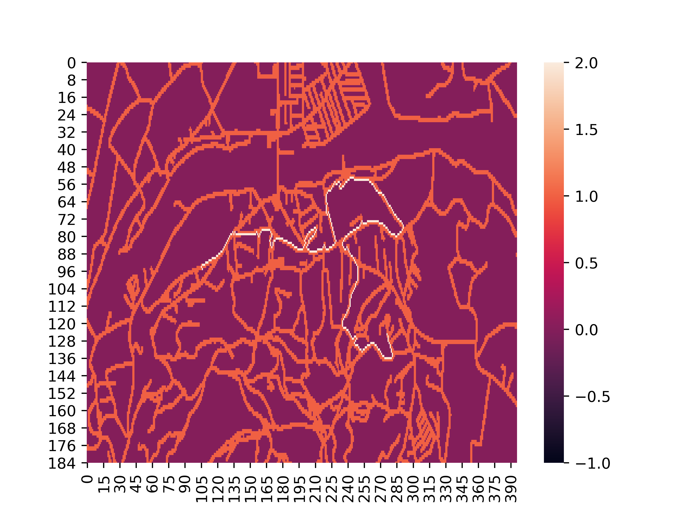
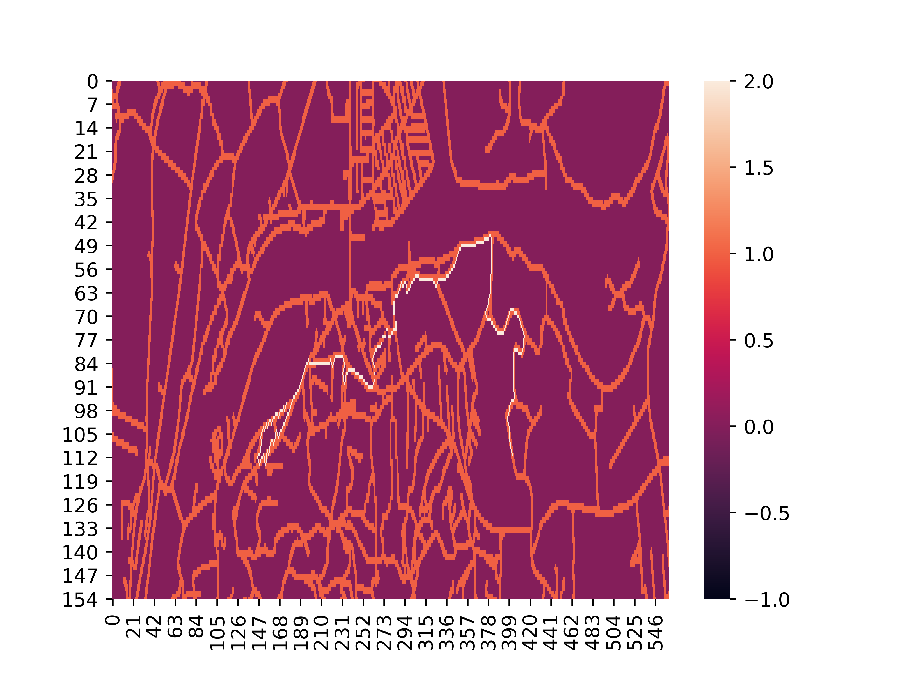
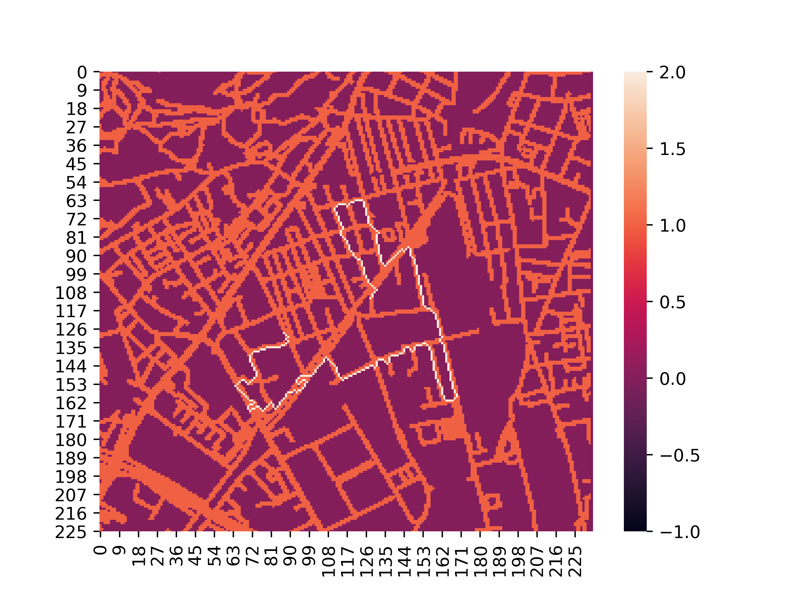
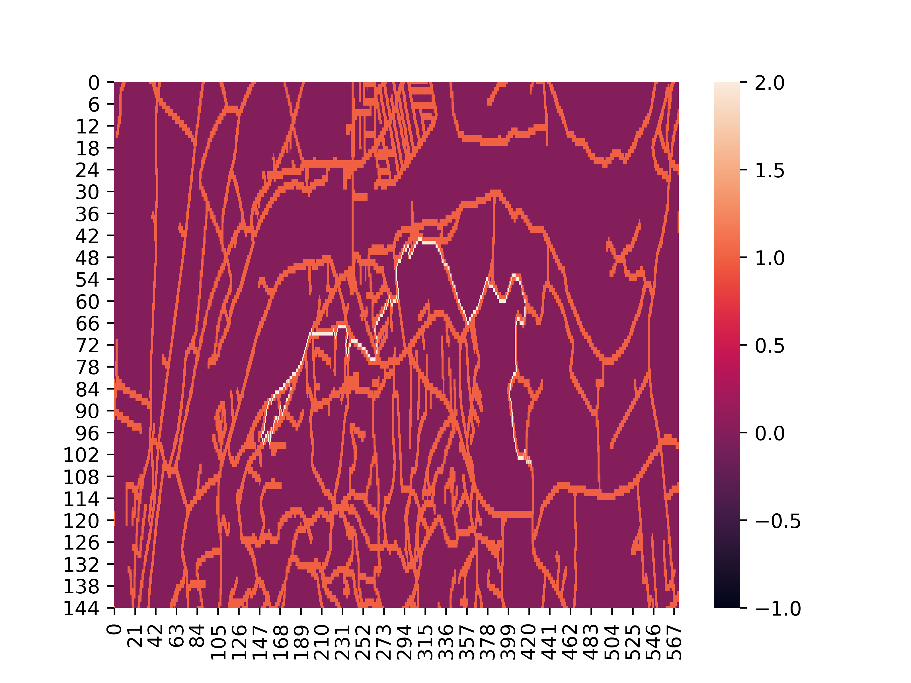
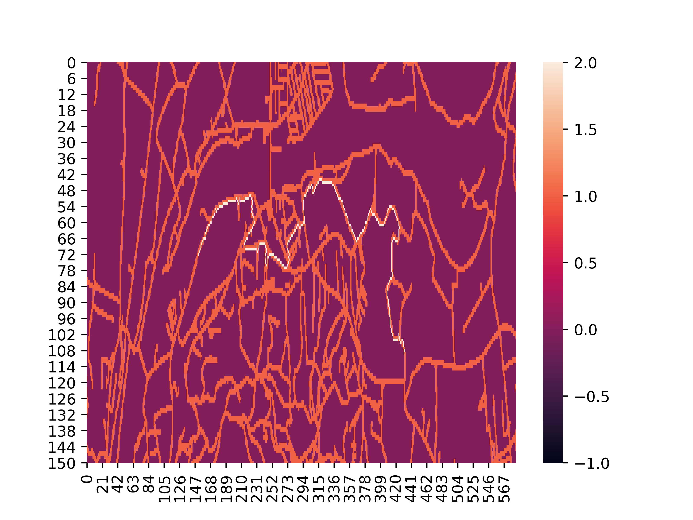
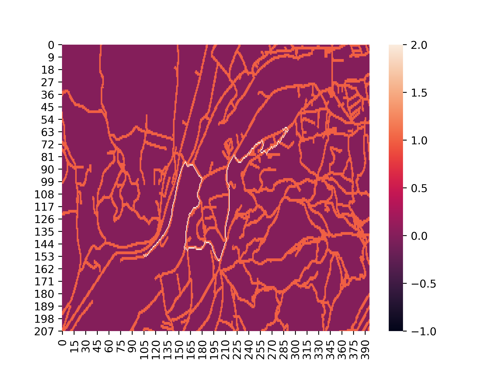
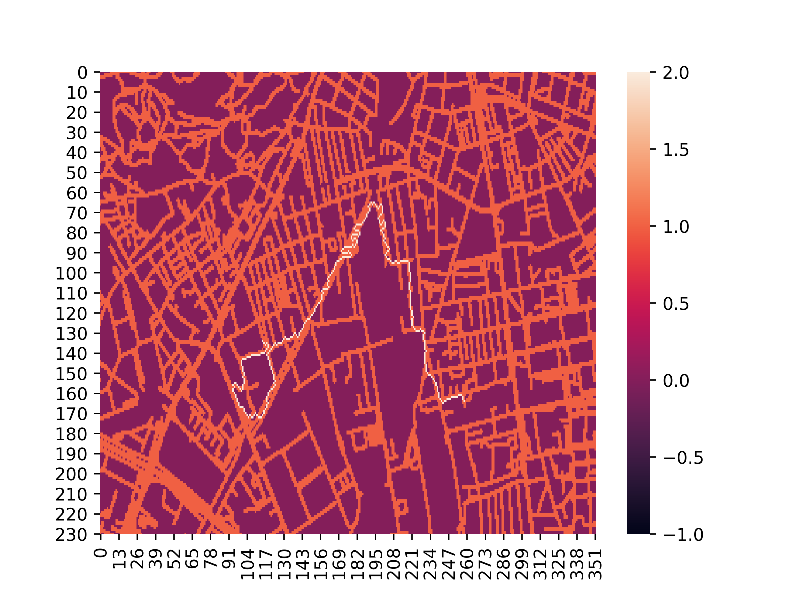
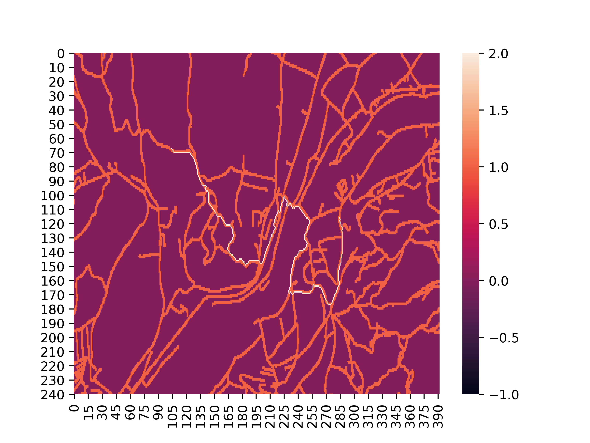
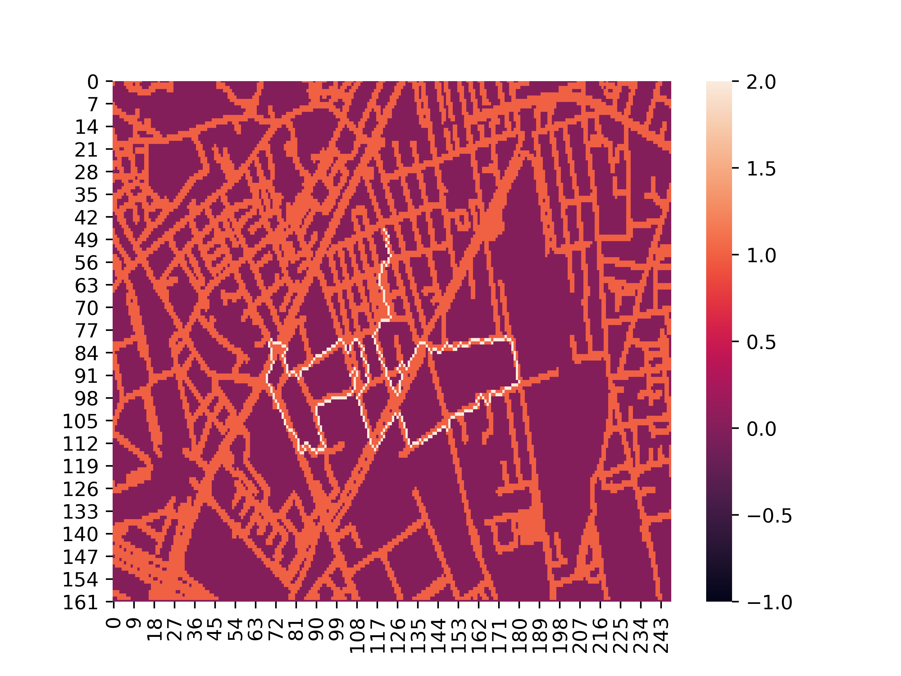

## Towards a human-like movements generator based on environmental features

Example of generated trajecotries using the different methods explained in the paper. In every pictures is visible the road system in red and the trajectory in white.

#### Fitness Based A* normal

|  |   |
| --------------------------------------- | ---------------------------------------- |
|  |   |
|  |  |

------

#### Fitness Based A* normal 100

|  |  |
| ------------------------------------- | ------------------------------------- |
|  |  |
|  |  |

-----

#### Fitness Based A* normal 110

|  |  |
| --------------------------------------- | --------------------------------------- |
|  |  |
|  |  |

